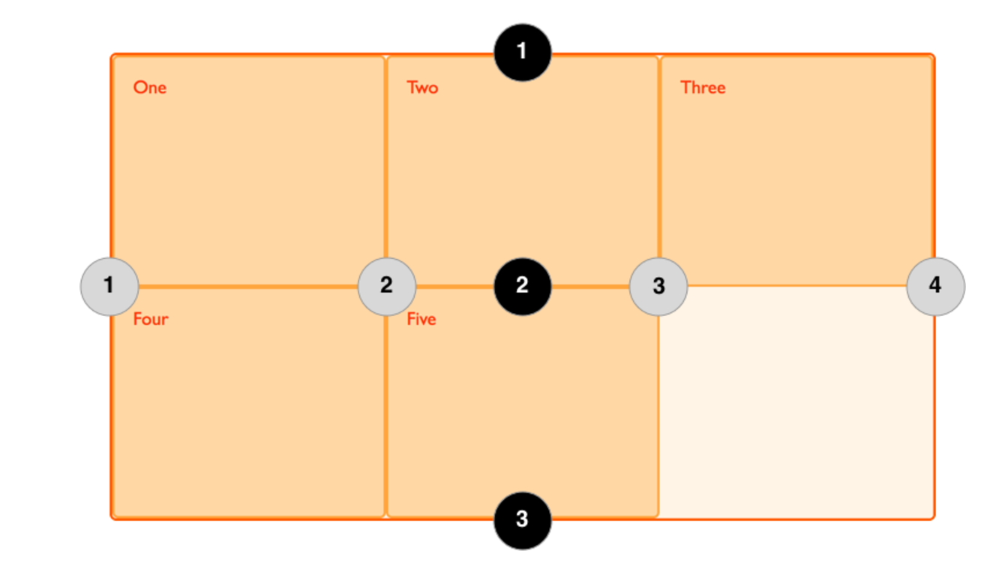

## Name grid line

Syntax like:
```css
            grid-template-columns:
            [left-sidebar-start] 1fr
            [main-content-start] 2fr
            [right-sidebar-start] 1fr;
```
We can named those whatever we want to.

We can also give multi name to one column:
```css
            grid-template-columns:
            [left-sidebar-start] 1fr
            [left-sidebar-end main-content-start] 2fr
            [main-content-end right-sidebar-start] 1fr
            [right-sidebar-end];
```
And we tell what the last column line is `right-sidebar-end`, later we can use this name like:
```css
        .footer {
            grid-column: main-content-start / right-sidebar-end;
        }
```

The same for the rows:
```css
            grid-template-rows:
                [body-start] 6fr
                [body-end footer-start] 2fr
                [footer-end];
```

### Grid line

So for four column lines: 

1 --> left-sidebar-start

2 --> left-sidebar-end, main-content-start

3 --> main-content-end, right-sidebar-start

4 --> right-sidebar-end

For three row lines:

1 --> body-start

2 --> body-end, footer-start

3 --> footer-end

To know more about grid line, check the [Post](https://developer.mozilla.org/en-US/docs/Web/CSS/CSS_Grid_Layout/Basic_Concepts_of_Grid_Layout#Grid_Tracks)