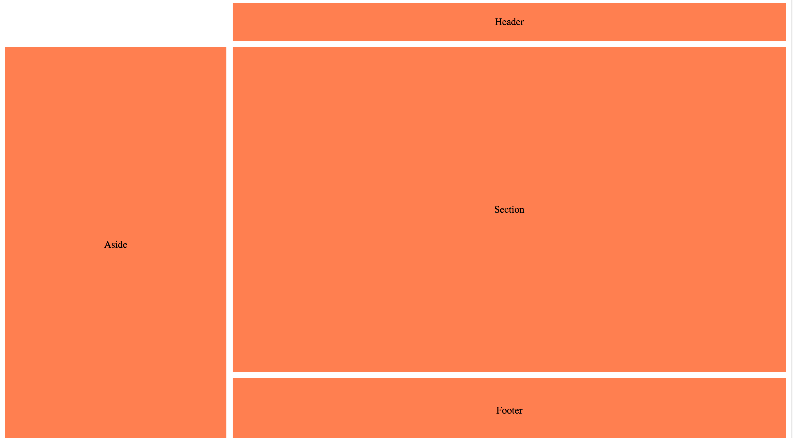

## Grid layout areas

* We can mix 'fr' with other units:
```css
grid-template-rows: 60px 10fr 2fr;
```

* We can use '.' as empty placeholder:
```css
            grid-template-areas:
                    ". header"
                    "aside section"
                    "aside footer";
```
It looks like this:
;

[DEMO](https://plnkr.co/edit/3UFnRwOs4SQVsmWdUj54)